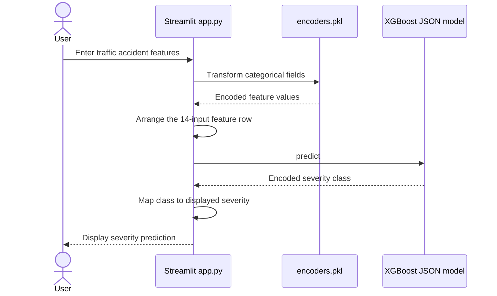

# Traffic Accident Severity Classifier

A Streamlit demonstration of accident severity classification from driver, vehicle, road, and environmental categories.

**Technology:** Python · XGBoost · pandas · Streamlit

## Features

- Collect 14 categorical accident attributes.
- Use the saved label encoders to prepare model inputs.
- Run an XGBoost classifier stored in JSON and display a severity label.

## Repository guide

| Path | Purpose |
|---|---|
| [app.py](app.py) | Categorical input form and inference logic. |
| [encoders.pkl](encoders.pkl) | Fitted category encoders. |
| [xgboost_accident_model.json](xgboost_accident_model.json) | Saved XGBoost classifier. |
| [requirements.txt](requirements.txt) | Runtime dependencies. |

## Requirements and current limitations

Keep `encoders.pkl` and `xgboost_accident_model.json` from the same training run. New categories must be handled consistently with the training encoders. This repository provides an inference demo; training data and a complete retraining pipeline are not included.

## UML diagrams

### Main workflow

The Streamlit interface applies the committed category encoders before inference with the saved XGBoost JSON model.



## Getting started

```bash
git clone https://github.com/IbrahimAbdelsattar/traffic.git
cd traffic
```

Use a Python virtual environment:

```bash
python -m venv .venv
```

Activate it with `source .venv/bin/activate` on macOS/Linux or `.venv\Scripts\Activate.ps1` in PowerShell.

```bash
python -m pip install -r requirements.txt
python -m streamlit run app.py
```
